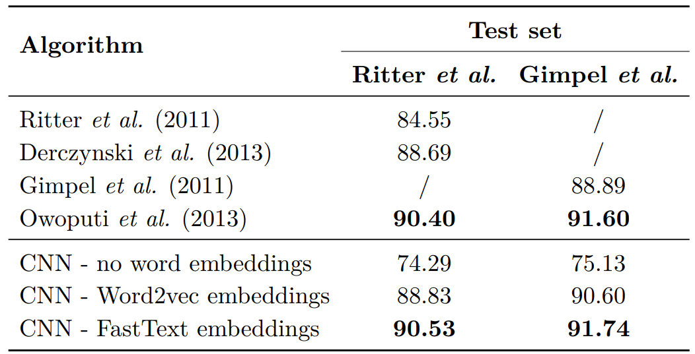

# Twitter word embeddings 
This repository contains a description of the Word2vec and FastText Twitter embeddings I have trained.
I wrote [a full blog post](https://fredericgodin.com/research/twitter-word-embeddings/) containing a summary of the results I obtained for PoS tagging and NER.

When used in combination with a Convolutional Neural Network, the FastText embeddings obtain a SOTA results on two different PoS tagging datasets



# Word2vec
If you want to use the original Word2vec binaries, you can still download them [here](https://github.com/tmikolov/word2vec).

You query for the most similar words using the following command:
```
distance word2vec_twitter_tokens.bin
```
And then query for a particular word such as 'running':
```
Enter word or sentence (EXIT to break): running

Word: running  Position in vocabulary: 1024

                                              Word       Cosine distance
------------------------------------------------------------------------
                                            runnin      0.763183
                                           Running      0.702059
                                            runing      0.696248
                                          runnning      0.662418
                                            runnig      0.625890
                                            runnng      0.598816
                                         sprinting      0.592531
                                               run      0.585368
                                           runnung      0.565600
                                           runninh      0.562288
                                   running/walking      0.552923
                                   walking/running      0.548576
                                            Runing      0.545418
                                           walking      0.537612
                                            Runnin      0.536183
...
```

You can also query for more noisy words such as 'runnnnning' which are still In-Vocabulary but return noisy results:
```
Enter word or sentence (EXIT to break): runnnnning

Word: runnnnning  Position in vocabulary: 2455079

                                              Word       Cosine distance
------------------------------------------------------------------------
                                         haaaarrrd      0.847242
                                          soakeddd      0.843479
                                     borrrrrrrrred      0.842695
                                       #teamnobaby      0.841109
                                    borrrreeeedddd      0.840885

```
But an issue arises when you query for Out-Of-Vocabulary words:
```Enter word or sentence (EXIT to break): runnnnnin

Word: runnnnnin  
Position in vocabulary: -1
Out of dictionary word!
```

# FastText
An example on how to load the FastText embeddings in Python is given in 'fasttext_example.py'.

You can also use the original binaries of [FastText](https://fasttext.cc/docs/en/unsupervised-tutorial.html).
For example, you can query the nearest neighbours using the following:
```
fasttext nn fasttext_twitter_raw.bin
```
and query for the word 'runnnnning':
```
Query word? runnnnning      
runnning 0.889969
runnnnn 0.814868
runnnn 0.791278
runnnnnn 0.790153
runnnin 0.759854
runnnn! 0.756956
runnnnnnn 0.740385
runnnn. 0.732345
runnn 0.732205
runnng 0.701806

```
Note that in this case the most similar words are also variants of the word 'runnnnning' which if different from when using Word2vec which resulted in complety different results.

The word 'runnnnnin' which is OOV in the case of Word2Vec does have a sensible reprentation and nearest neighbours in FastText:
```
Query word? runnnnnin
runnnin 0.897067
runnnnn 0.83868
runnnnnn 0.815477
runnnn 0.800057
runnning 0.785145
runnnnnnn 0.765215
runnnn! 0.761826
runnn 0.751768
runnnn. 0.736897
runnnnnnnn 0.711983


```


# Download
The Twitter Word2vec embeddings can be downloaded [here](https://drive.google.com/open?id=1lw5Hr6Xw0G0bMT1ZllrtMqEgCTrM7dzc).
The Twitter FastText embeddings can be downloaded [here](https://drive.google.com/open?id=15zXlbO3bxSYTPt71Fon5-0-oCB8iMSno).

# Citation
If you like this repository and use the embeddings, please cite the following publication:

```
@phdthesis{godin2019,
     title    = {Improving and Interpreting Neural Networks for Word-Level Prediction Tasks in Natural Language Processing},
     school   = {Ghent University, Belgium},
     author   = {Godin, Fr\'{e}deric},
     year     = {2019},
 }
```